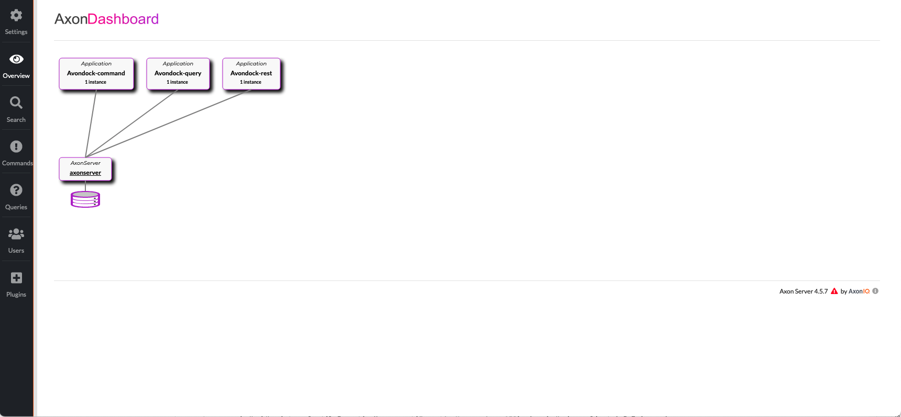
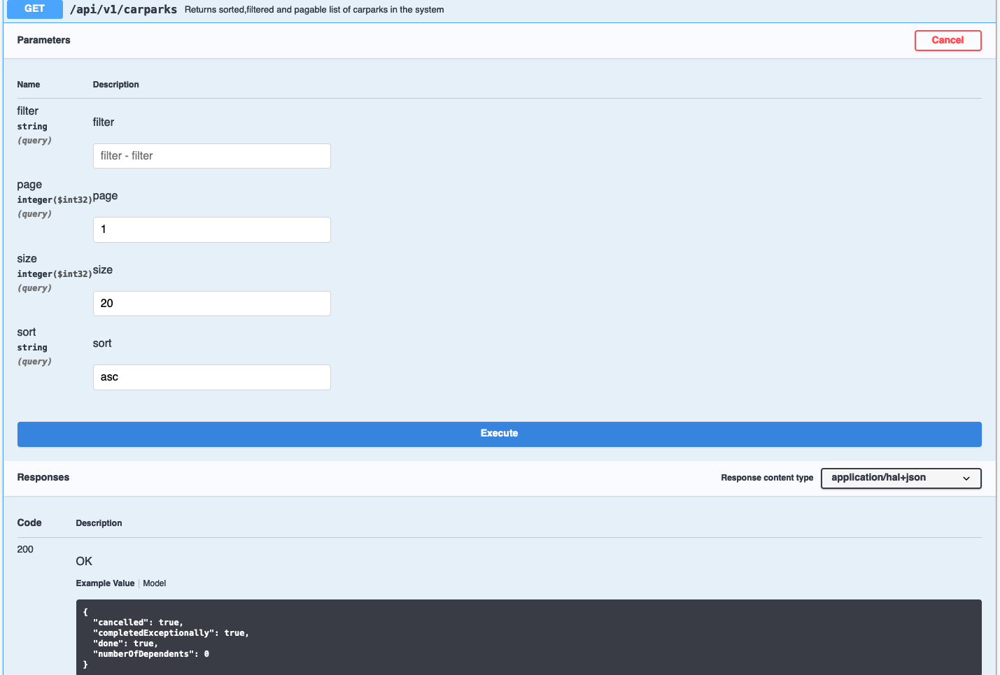

## Backend API

#### Activate Profiles (for Axon Instances)

Uncomment the section for that at application.properties

Uncomment the @Profile("command") annotation in the Aggregate and start ->

```
./mvnw spring-boot:run -Dspring-boot.run.arguments=--spring.profiles.active=command
```

Uncomment the @Profile("query") annotation in the Projection class and start ->

```
./mvnw spring-boot:run -Dspring-boot.run.arguments=--spring.profiles.active=query
```

Uncomment the @Profile("rest") annotation in both gateways and start ->

```
./mvnw spring-boot:run -Dspring-boot.run.arguments=--spring.profiles.active=rest
```

This will start 3 own instances the command way on port 8099 the query context on port 8097
and the rest endpoints has to keep the port 8098, for frontend communications

Open localhost:8024/#overview you will see now this:



#### Testing manual your Rest endpoints

Open for ex. http://localhost:8098/swagger-ui/#/car-park-query-endpoint/listCarParksUsingGET

Check out 'Try out' and execute


